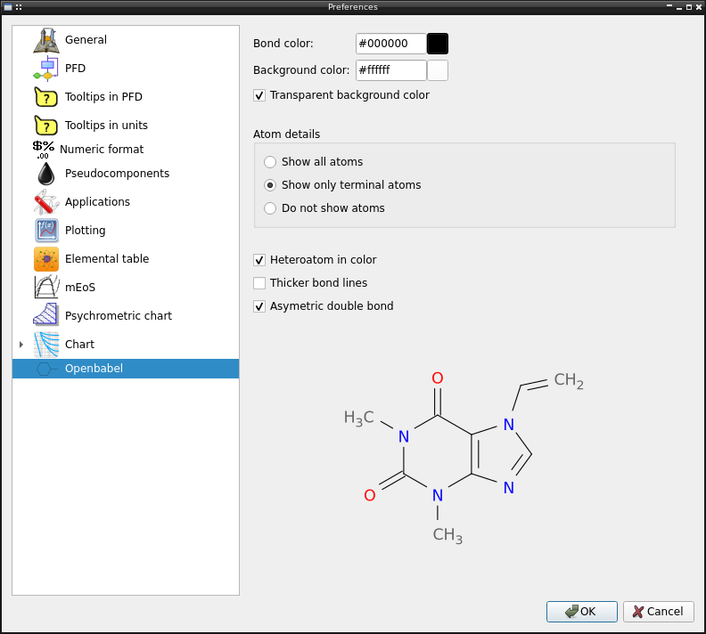

Pychemqt has many option to customize for the user, in this dialog user can change default options as desired. The dialog has several tab to organized configuration

General
-------

General main program options

  * Hightlight color in input
  * Read only color in input
  * Number of recent files shows in menu
  * Load last sessions project at start
  * Show tray icon

PFD
---

Proces Flow Diagram (PFD) options

  * Background brush color
  * Background brush style
  * Input stream color
  * Output stream color
  * Line format options (color, width, join, cap, dash)
  * PFD resolution

Tooltips in PFD
---------------

When the mouse is over a entity in PFD, a popup dialog with calculated properties can be shown with the properties defined in this tab

Tooltips in units
-----------------

When the mouse is over a entry with units support, a popup dialog with other units values can be shown as defined in this tab

Numeric Format
--------------

Prefered numeric format when show a number in any text 

The options include the normal format options

  * Fixed decimal point defining total and decimal digits
  * Significant figures
  * Exponential format by default
  * Exponential format for big/small values
  * Show sign in positives values
  * Show thousand separator (for currency for example)

Pseudocomponents
----------------

Define preferred methods to calculate properties when define oil pseudocomponents

  * Molecular weight
  * Critic properties
  * Critic volume
  * Acentric factor
  * Zc
  * Boiling temperature
  * Specific gravity
  * Refractive index
  * PNA composition
  * Destilate curve conversion
  * Hydrogen composition %

Applications
------------

External applications call from pychemqt

  * Calculator
  * Text file viewer
  * Use external pdf viewer, pychemqt has a simple internal pdf viewer
  * Shell used along options (background, foreground color, use ipython)

Plotting
--------

Plot can be configurated using the complete set of `matplotlib config options <https://matplotlib.org/stable/users/explain/customizing.html>`_

  * Can be use the matlotlib predefined styled
  * Customizing any of option available in matplotlibrc

qtelemental
-----------

Configuration avilable for the periodic table tools

  * Properties to define color squeme
  * Color scale

MEoS
----

Advanced properties library calculation options

  * Use external libraries (Coolprop, RefProp) if it's availables
  * Saturation line style (width, dash, color, marker)
  * Isolines shows in plots, as range or a list of lines values including line style config
  * Plot definition using more point (more slow)
  * Draw grid
  * 3D plot options (draw mesh, mesh type, colormap, wireframe line config)

Psychrometric tools
-------------------

Configuration for the psychrometric tool

  * Chart type (ASHRAE, Mollier)
  * Use virial or external application if availables
  * Saturation line style (width, dash, color, marker)
  * Crux line style (width, dash, color, marker)
  * Isolines shows in plots, as range or a list of lines values including line style config, label and its config

Moody chart
-----------

Moody chart configuration 

  * Method
  * Calculate fanning friction factor (by default it calculates the darcy friction factor)
  * ε/D isolines
  * Reliative roughtness line style (width, dash, color, marker)
  * Crux line style (width, dash, color, marker)
  * Grid line style (width, dash, color, marker)

Drag sphere chart
-----------------

Drag sphere chart configuration

  * Method
  * Drag coefficient line style (width, dash, color, marker)
  * Crux line style (width, dash, color, marker)
  * Grid line style (width, dash, color, marker)

Standing-Katz chart
-------------------

Standing-Katz chart configuration

  * Method
  * Tr lines
  * Reduced temperature line style (width, dash, color, marker)
  * Crux line style (width, dash, color, marker)
  * Grid line style (width, dash, color, marker)

Openbabel
---------

Configuration of libray openbabel to adjust the generated image

  * Bond color
  * Background color
  * Heteroatoms in color
  * Atoms details (show all atoms, only the terminal atoms)
  * Thicker bond lines
  * Asymetric double bond
  * Show atom index

API reference
-------------
