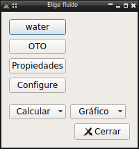
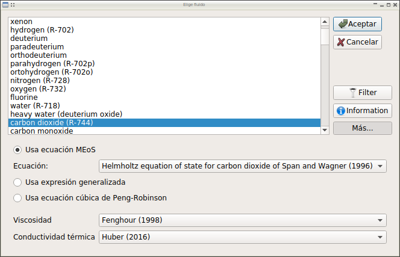
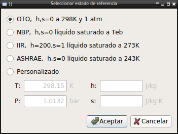
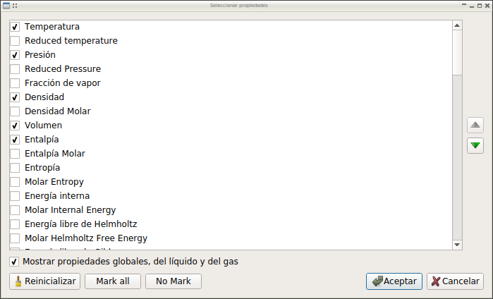

tools.UI_Tables package
=========================
Tool for use the multiparamter equation of state of several fluids to high
accuracy property calculations.

The module can use several libraries as calculation procedures:

    * The internal mEoS library
    * CoolProp
    * RefProp

The fluids availables depend of library used, for the internal library are:

.. include:: lib.mEoSlst.rst

All functionality are integrate in pychemqt main program, accesible in main
menu Tools/MEoS. Furthermore these equations of state are available to use in
process stream properties calculation.

Configuration
-------------

First at all it's necessary configure the tool, only it's mandatory to define
the fluid to calculate, reference state and propertie shown are configurable
too

**Fluid**

In a open project we must first define the fluid to calculate properties,
Tools/MEoS/Fluid. When we have defined a fluid the name appear in this menu
option.

In this dialog we can choose the EoS to use, and if there several options, the
method to calculate the viscosity or thermal conductivity.

**Reference**

We can define the reference state for entropy and enthalpy zero point,
Tools/MEoS/Reference. We can choose between any of standard reference states or
define a custom.

**Properties**

In table generation the properties to show and the order can be configured
here, Tools/MEoS/Properties.

The properties available depend of backend used in library.

Furthermore, for configure the library to use and several parameters for plot
generation, use the options Tools/MEoS/Configure, or use the tab in main
program Preferences dialog.

Usage
-----

**Table**

It's possible use a table to calculate specific properties or to calculate
any serie or states, saturation, isoproperties...
In all cases it's possible configure the numeric format, convert values to
other unit magnitude or export the data to csv.

**Plot**

There are direct access to get the usual diagram as T-s, P-h, h-s and more.
This plot are generated using the default configuration, but can be edited
later by right click over it. The editing option included:

* Configure legend in plot
* Add/Delete isolines
* Add/Delete individual point of isolines
* Configure line style and annotation for isolines
* Get tabulated data of lines

The resulting plot can be saved to file as png image.

The plot support too mouse click interaction to get properties of selected
point.

The procedure of plot data calculation could be very slow, specialy with native
library and using high quality definition, for that reason the calculated data
are saved in hard-disk to speed-up loading in next execution or other graph
generation, that files in .pkl format are saved in main program configuration
folder.

API reference
-------------
