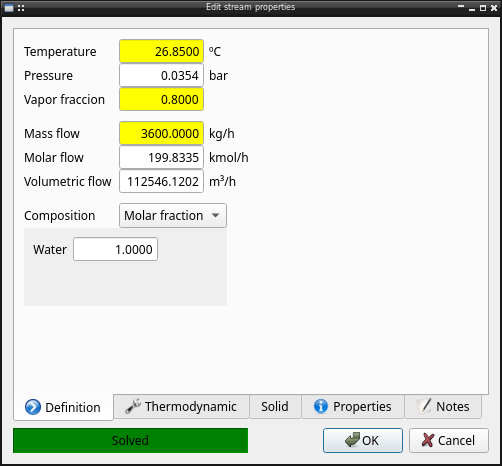
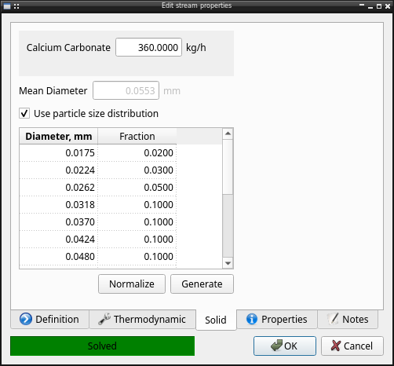
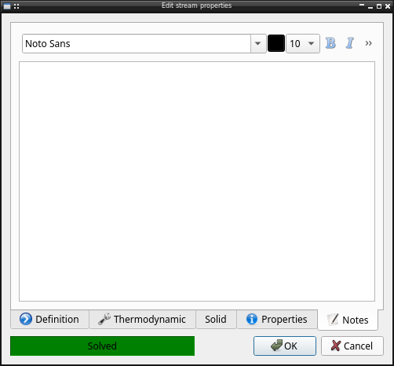
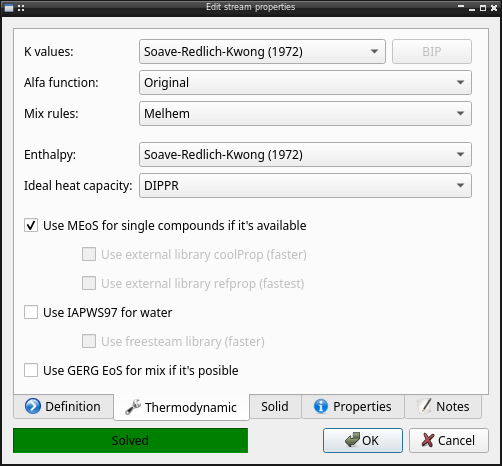
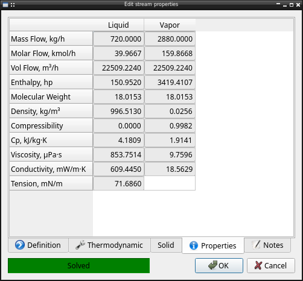

UI_corriente module
===================

A fundamental characteristic of a process design simulator like pychemqt is the definition of a stream with temperature, pressure, composition, vapor fraction as input parameters.

The specified properties are resalted in special color, to let user know the input parameters.

In case any solid compound is used the solid tab is enabled to configure solid properties

Its possible add any type of information in the notes tab with a basic text editor

Configuration
-------------

The methods used for calculation can be configurated in the Thermodynamic tab

**K values**
Configure the equation of state used for phase equilibrium calculation, including the binary interation parameters if the stream is multicomponent for the EoS with support for that.
For several cubic equation is possible configure too the alpha function used, and the mixing rules for multicomponent stream.

**H values**
Configure the methods (equation of state or other method) used for enthalpy calculation and the ideal enthalpy method.

**Advanced options**
Furthermore it's possible check any advanced option available like mEoS library, external library alternative to mEoS like coolProp or refProp if available, iapws for water, external freesteam library for water, mEos GERG extension to mixtures.

Properties
----------

When the definition is complete the calculated properties can be see in the properties tab

API reference
-------------
