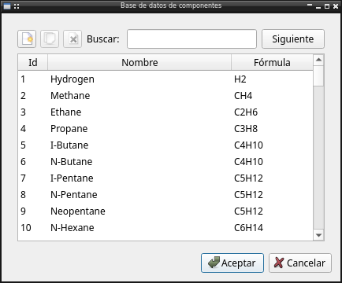
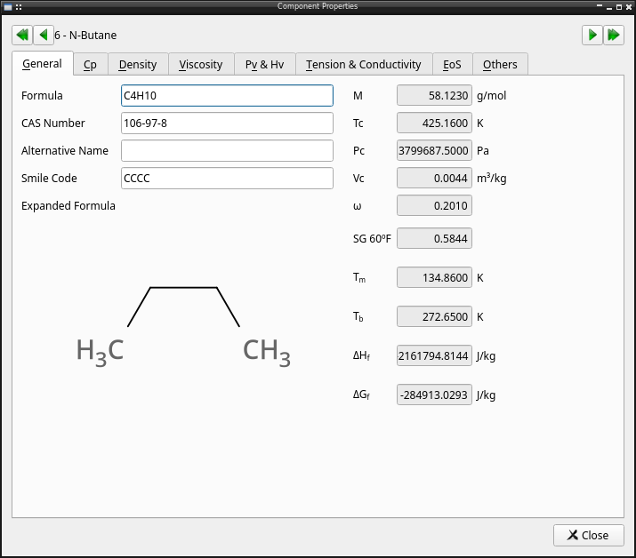
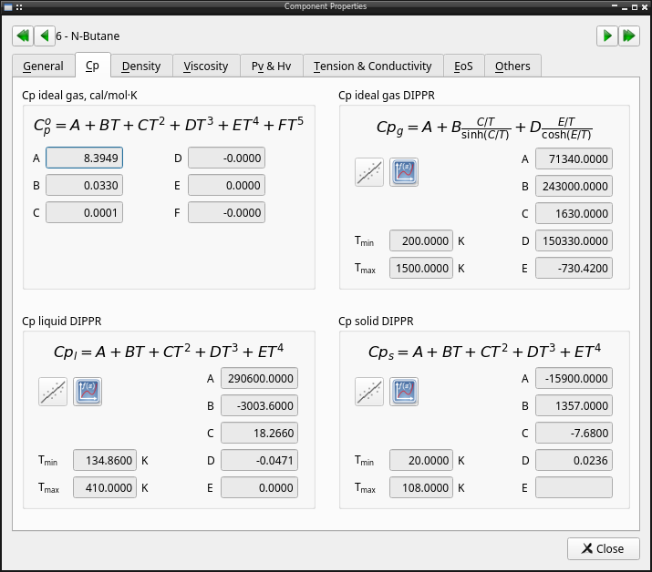
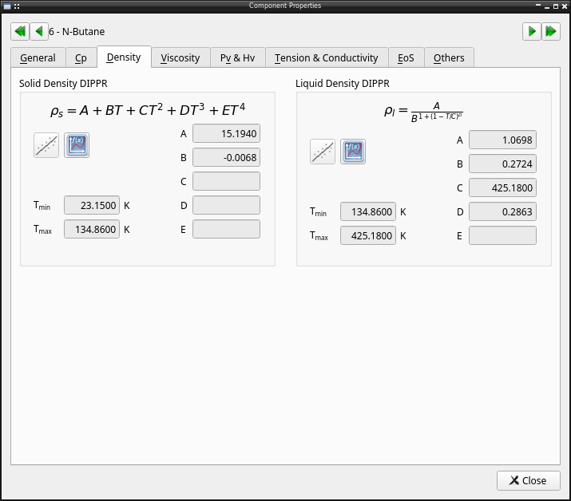
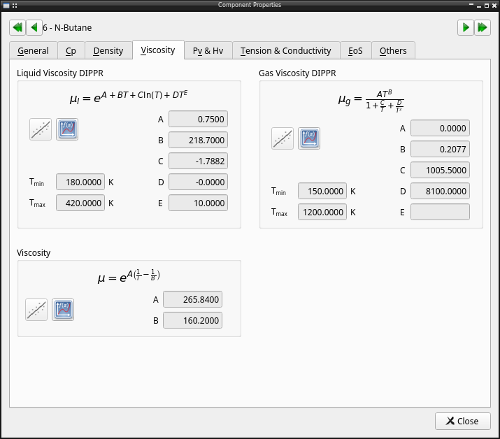
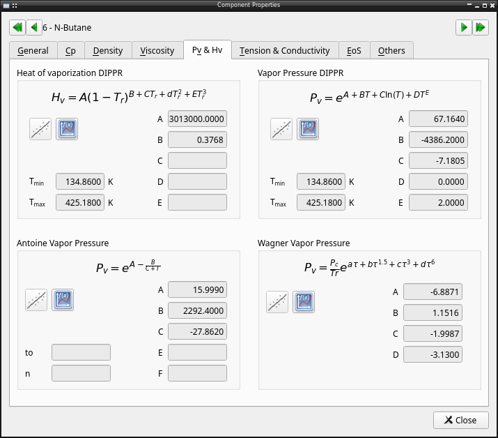
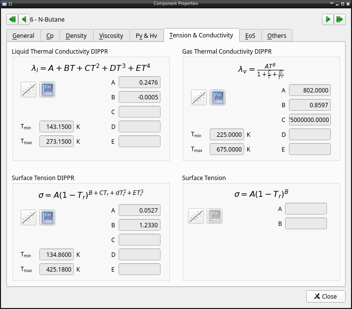
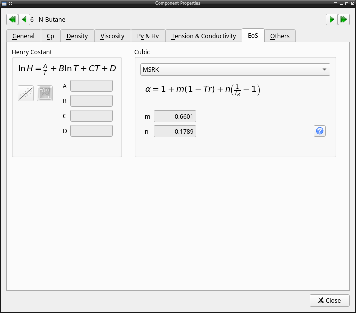
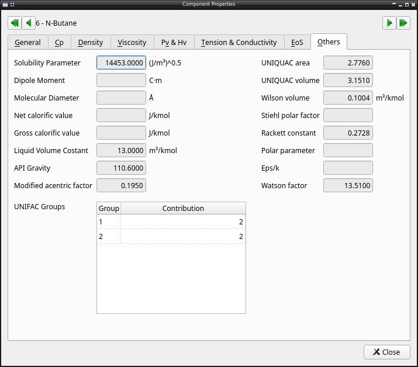

Pychemqt include a database compound with 1000 compounds including chemical and physical properties like:

  * Name
  * Formula
  * Molecular weight
  * Critical temperature
  * Critical pressure
  * Critical volume
  * API degree
  * Ideal gas specific heat capacity temperature dependence parameters
  * Antoine vapor pressure temperature dependence parameters
  * Henry temperature dependence parameters
  * Surface tension temperature dependence parameters
  * Solid density temperature dependence parameters (DIPPR)
  * Liquid density temperature dependence parameters (DIPPR)
  * Vapor pressure temperature dependence parameters (DIPPR)
  * Vaporization heat temperature dependence parameters (DIPPR)
  * Solid specific heat temperature dependence parameters (DIPPR)
  * Liquid specific heat temperature dependence parameters (DIPPR)
  * Gas specific heat temperature dependence parameters (DIPPR)
  * Liquid viscosity temperature dependence parameters (DIPPR)
  * Gas viscosity temperature dependence parameters (DIPPR)
  * Liquid thermal conductivity temperature dependence parameters (DIPPR)
  * Gas thermal conductivity temperature dependence parameters (DIPPR)
  * Surface tension temperature dependence parameters (DIPPR)
  * Dipole moment
  * Liquid volumen constant 
  * Rackett constant
  * Specific gravity
  * Acentric factor
  * Solubility parameter
  * Watson constant
  * Stiehl constant
  * Normal boiling point
  * Normal melting point
  * CAS code number
  * Alternate formula
  * UNIFAC contributión
  * Molecular diameter
  * ε/k parameter
  * UNIQUAC area parameter
  * UNIQUAC volume parameter
  * Modified acentric factor
  * Enthalpy of formation
  * Free Gibbs enery of formation
  * Wilson volume parameter
  * Net heat of combustion
  * Gross heat of combustion
  * Alternate names
  * Characteristic volume
  * Solid heat of formation
  * Solid free energy
  * Polar parameter
  * SMILE code

To manage the database there is a graphical tool. In this dialog it's possible search compound by name, or chemical formula, view properties of any desired compounds, define new compounds added its properties, or clone and existing compound. The user defined comounds are saved in the file databank

It's possible double click over any compound to view the properties of that element

API reference
-------------

