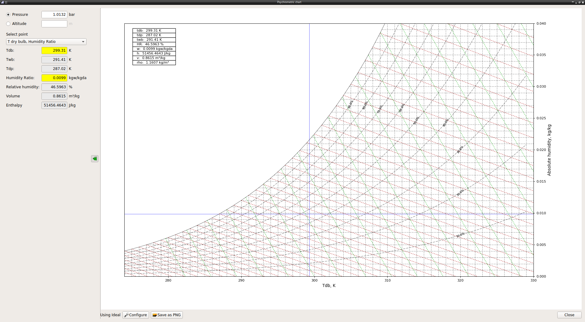
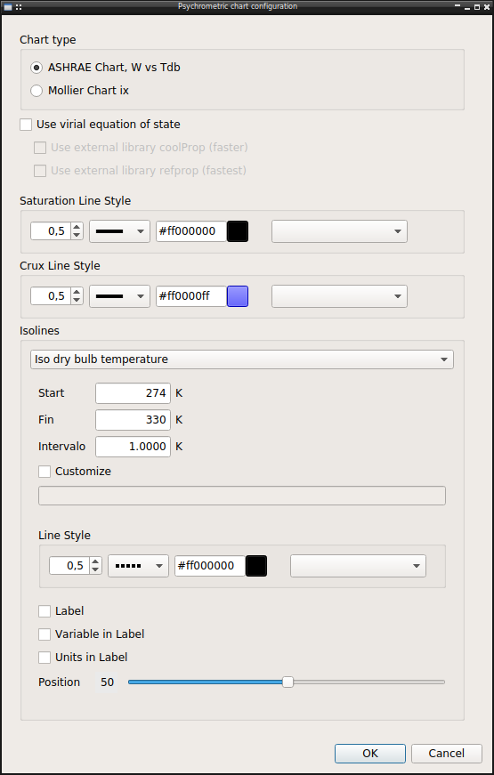

This tool show a psychrometry (humid air) chart.

The chart let user click to get the properties.
Furthermore it's possible define a point using the lateral panel and any of the input pair availables:

    * Dry bulb temperature - Humidity Ratio
    * Dry bulb temperature - Relative humidity
    * Dry bulb temperature - Wet bulb temperature
    * Dry bulb temperature - Dew point temperature
    * Dew point temperature - Relative humidity
    * Wet bulb temperature - Relative humidity

Also it's possible change the pressure of the chart, or the altitude using the standard ASHRAE atmosphere equation

The chart can be saved as image file using the apropiate button. 

Configuration
-------------
The chart can be configurated using the dialog

**Chart type**

There is two kind of psychrometric chart used in engineering, both supported, the normal ASHRAE chart with humidity ratio vs dry bulb temperature and the Mollier Chart with inverted axes.

**Equation to use**

By default use the ideal equation of state. The other option using the virial equation of state are unimplemented, only the external CoolProp library is now working

**Line Style**

For each kind of line it's possible configure the line style, width, linestyle, color, marker ...

**Units**

The units used in chart are the used in the last project open in main program. So it's configurable using the project units configuration dialog.
