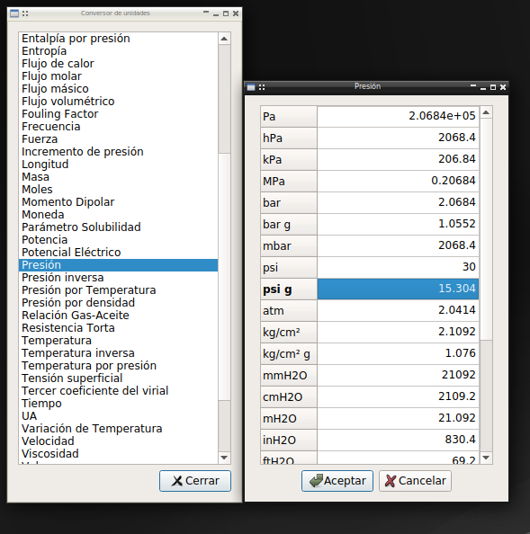

Pychemqt include a robust physics units support, with conversion in all input
or output site where necessary, and configurable for each project in his
configuration dialog.

This main feature include this standalone tool for direct conversion.

API reference
-------------
