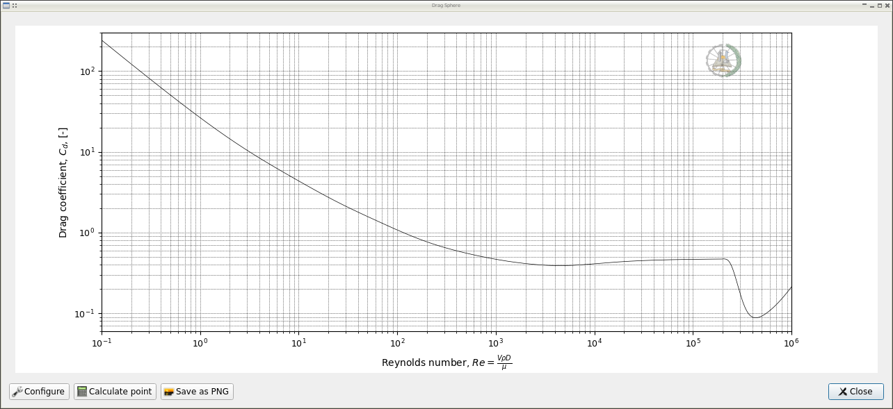
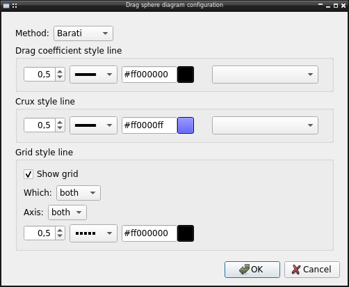

Plot the drag coefficiente as function of reynolds number of a sphere.

The diagram include all Reynolds number range, support for click interaction,
let user save the chart as image and a dialog to calculate a individual point:

.. image:: images/dragPoint.png
    :alt: calculate point

Configuration
-------------

The diagram let user configure several options like:

* Equation to use, by default the Barati correlation, but it's possible
  use one of available in :doc:`lib.drag <../lib.drag>`
* Line style used in plot
* Line style used in crux when use mouse
* Grid line visibility and style

Example
-------

Comparing some correlations with experimental data

.. code-block:: python

    from matplotlib import pyplot
    from numpy import logspace

    from lib.drag import Clift, Mikhailov, Concha, Barati

    corr = {
        Clift: {"c": "black", "ls": ":"},
        Barati: {"c": "green", "ls": ":"},
        Mikhailov: {"c": "red", "ls": ":"},
        Concha: {"c": "blue", "ls": ":"}}

    Re = logspace(-1, 6, 100)
    for f, kw in corr.items():
        Cd = []
        for re in Re:
            try:
                v = f(re)
            except NotImplementedError:
                v = None
            Cd.append(v)
        pyplot.plot(Re, Cd, label=f.__name__, **kw)

    # Experimental date
    # Morsi, S.A., Alexander, A.J.
    # An Investigation of Particle Trajectories in Two-Phase Flow Systems
    # J. Fluid Mechanics 55(2) (1972) 193-208
    # doi: 10.1017/S0022112072001806
    Re = [0.1, 0.2, 0.3, 0.5, 0.7, 1, 2, 3, 5, 7, 10, 20, 30, 50, 70, 100, 200,
          300, 500, 700, 1000, 2000, 3000, 5000, 7000, 10000, 20000, 30000,
          50000]
    Cd = [240, 120, 80, 49, 36.5, 26.5, 14.4, 10.4, 6.9, 5.4, 4.1, 2.55, 2, 1.5,
          1.27, 1.07, 0.77, 0.65, 0.55, 0.5, 0.46, 0.42, 0.4, 0.385, 0.39, 0.41,
          0.452, 0.4697, 0.488]
    pyplot.plot(Re, Cd, ls='', marker="s", mec="k", mfc="grey", label="72-Mor/Ale")

    # Roos, F.W., Willmarth, W.W.
    # Some Experimental Results on Sphere and Disk Drag
    # Amer. Inst. Aeronautics and Astronautics 9(2) (1971) 285-291
    # doi: 10.2514/3.6164
    Re = [5.33, 5.99, 11.0, 13.1, 13.2, 13.9, 14.6, 16.2, 21.1, 23.4, 29.1, 45.0,
          50.6, 54.4, 68.9, 68.9, 78.2, 88.1, 93.8, 101, 104, 108, 109, 124, 130,
          138, 163, 168, 170, 186, 186, 189, 190, 191, 193, 229, 229, 240, 258,
          280, 284, 286, 311, 312, 318, 358, 361, 364, 379, 409, 444, 468, 472,
          480, 500, 522, 532, 532, 557, 579, 588, 603, 644, 713, 727, 833, 932,
          984, 985, 985, 1000, 1000, 1070, 1330, 1650, 1690, 1950, 2000, 5570,
          5990, 6210, 6250, 6900, 7280, 7520, 8230, 8580, 8700, 9620, 13300, 13400,
          13900, 14700, 16800, 18000, 18700, 19500, 21200, 23100, 23600, 23700,
          24100, 24200, 25000, 28000, 31900, 32400, 33800, 35400, 35500, 38200,
          41800, 45900, 46800, 52400, 53500, 57500, 57700, 71900, 89000, 100000,
          118300]
    Cd = [7.06, 6.41, 4.01, 3.76, 3.66, 3.59, 3.41, 3.29, 2.82, 2.48, 2.28, 1.79,
          1.58, 1.52, 1.35, 1.33, 1.27, 1.12, 1.03, 1.08, 1.05, 1.02, 1.03, 0.994,
          0.927, 0.907, 0.879, 0.799, 0.819, 0.799, 0.841, 0.778, 0.751, 0.799,
          0.732, 0.711, 0.710, 0.700, 0.721, 0.674, 0.646, 0.675, 0.592, 0.607,
          0.656, 0.627, 0.600, 0.632, 0.595, 0.579, 0.585, 0.578, 0.566, 0.572,
          0.547, 0.544, 0.543, 0.556, 0.552, 0.523, 0.520, 0.531, 0.525, 0.505,
          0.480, 0.485, 0.472, 0.466, 0.477, 0.485, 0.472, 0.483, 0.452, 0.436,
          0.440, 0.435, 0.427, 0.430, 0.460, 0.430, 0.390, 0.451, 0.460, 0.430,
          0.435, 0.429, 0.390, 0.490, 0.490, 0.460, 0.480, 0.400, 0.460, 0.452,
          0.510, 0.523, 0.500, 0.509, 0.511, 0.529, 0.455, 0.524, 0.520, 0.519,
          0.495, 0.500, 0.479, 0.457, 0.482, 0.504, 0.513, 0.485, 0.467, 0.468,
          0.503, 0.497, 0.480, 0.492, 0.451, 0.502, 0.467, 0.476]
    pyplot.plot(Re, Cd, ls='', marker="o", mec="k", mfc="grey", label="71-Roo/Wil")

    # Achenbach, E.
    # Experiments on the Flow Past Spheres at Very High Reynolds Numbers
    # J. Fluid Mech. 54(3) (1972) 565-575
    # doi: 10.1017/S0022112072000874
    # Selected point of figure 4, the paper don't report the experimental data
    Re = [4.4e4, 6e4, 8e4, 1e5, 2e5, 3e5, 4e5, 6e5, 8e5, 1e6]
    Cd = [0.48, 0.5, 0.51, 0.52, 0.52, 0.3, 0.07, 0.08, 0.095, 0.11]
    pyplot.plot(Re, Cd, ls='', marker="d", mec="k", mfc="grey", label="71-Ach")

    pyplot.ylabel("$C_d$, [-]")
    pyplot.xlabel("Re, [-]")
    pyplot.xscale("log")
    pyplot.yscale("log")
    pyplot.legend()
    pyplot.show()

.. image:: images/dragExample.png
    :alt: Drag coefficient for smooth spheres

