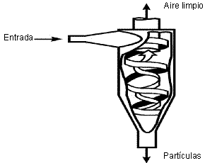
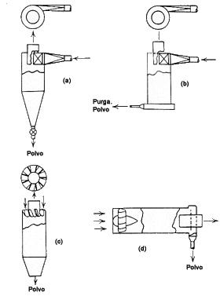
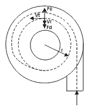
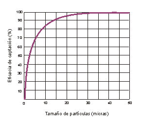
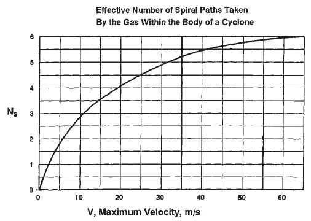
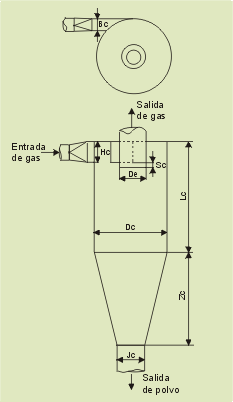
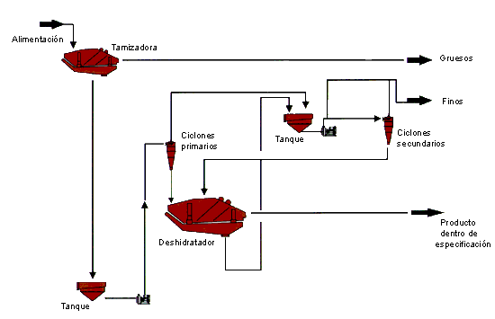
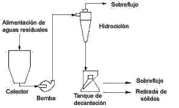

Descripción
===========

Los ciclones son uno de los equipos más empleados dentro de las operaciones
de separación de partículas sólidas de una corriente gaseosa, además de poder
emplearse para separar sólidos de líquidos. Su éxito se debe en parte a que
son equipos de una gran sencillez estructural debido a que no poseen partes
móviles y a que apenas exigen mantenimiento.

Además destaca el hecho de que, al hacer uso de fuerzas centrífugas en vez de
gravitatorias, la velocidad de sedimentación de las partículas se incrementa
en gran medida haciéndose más efectiva la separación.

Un separador ciclónico está compuesto básicamente por un cilindro vertical
con fondo cónico, dotado de una entrada tangencial normalmente rectangular.

La corriente gaseosa cargada con las partículas sólidas se introduce
tangecialmente en el recipiente cilíndrico a velocidades de aproximadamente
30m/s, saliendo el gas limpio a través de una abertura central situada en la
parte superior.

Por tanto, se observa que el modelo de flujo seguido por el gas dentro de los
ciclones es el de un doble vórtice. Primero el gas realiza una espiral hacia
abajo y por la zona exterior, para después ascender por la zona interior
describiendo igualmente una hélice.

Las partículas de polvo, debido a su inercia, tienden a moverse hacia la
periferia del equipo alejándose de la entrada del gas y recogiéndose en un
colector situado en la base cónica.

Se trata de un equipo muy eficaz a menos que la corriente gaseosa contenga
una gran proporción de partículas de diámetro inferior a unos 10 µm. Aunque
se puedan emplear ciclones para separar partículas con diámetros mayores de
200 µm, esto no suele ser muy frecuente ya que los sedimentadores por
gravedad o los separadores por inercia resultan normalmente más efectivos y
menos sujetos a abrasión.

Se puede emplear tanto para gases cargados de polvo como de niebla, es decir,
para pequeñas partículas líquidas.

Tipos
=====

Los ciclones convencionales se pueden encontrar en una gran variedad de
tamaños y la entrada al equipo puede ser bien rectangular o circular.

Una forma de clasificar los distintos tipos se puede efectuar atendiendo a la
manera en que se produce la carga y la descarga del equipo y otro modo sería
en función de su eficacia.

De acuerdo a su disposición geométrica se distinguen los siguientes tipos de
separadores ciclónicos:

a. Los ciclones de entrada tangencial y descarga axial representan el ciclón
   tradicional y, aunque se pueden construir con diámetros más grandes, lo
   más frecuente es que éstos se encuentren entre los 600 y los 915 mm.
b. En los ciclones con entrada tangencial y descarga periférica, el gas sufre
   un retroceso en el interior del equipo al igual que ocurre en un ciclón
   convencional. Sin embargo, presenta el inconveniente de que el polvo no es
   eliminado en su totalidad de la corriente gaseosa, aunque sí se produce
   una concentración del mismo.
c. En los ciclones con entrada y descarga axial la diferencia fundamental se
   encuentra en que los diámetros son de menores dimensiones (entre 25 y 305
   mm), con lo que gracias a esta característica su eficicencia es mayor
   aunque su capacidad es menor.
d. Por otra parte, los ciclones de entrada axial y salida periférica
   proporcionan un flujo directo que es muy adecuado para conectarlos a
   fuentes de gran volumen, donde los cambios en la dirección del gas podrían
   ser un inconveniente.

El principio de funcionamiento en el cual se basan estos tipos de ciclones
es muy similar.

Otra posible clasificación de los ciclones se puede realizar en función de su
eficacia. La eficacia de un ciclón está determinada en gran medida por su
tamaño. Se ha comprobado que los ciclones de menor diámetro son los que
proporcionan mejores eficacias en la separación de partículas. Asimismo se
observa que la altura total del equipo también afecta a la eficacia,
aumentando ésta con la altura.

Según este criterio se consideran los siguientes tipos:

- muy eficientes ( 98 – 99%)
- moderadamente eficientes ( 70- 80%)
- de baja eficiencia ( 50%)

Existen también los denominados hidrociclones que se encargan de separar las
partículas sólidas de de corrientes líquidas.
 

Funcionamiento
==============

El gas se mueve en el interior del ciclón con una trayectoria de doble
hélice. Inicialmente realiza una espiral hacia abajo, acercándose
gradualmente a la parte central del separador, y a continuación se eleva y lo
abandona a través de una salida central situada en la parte superior dejando
atrás las partículas.

Una vez que el gas penetra tangencialmente en el equipo se distinguen dos
zonas de características distintas de movimiento:

 * en la zona próxima a la entrada del gas y en aquella más exterior del
   cilindro predomina la velocidad tangencial, la velocidad radial es
   centrípeta y la axial de sentido descendente. La presión es relativamente
   alta.
 * en la zona más interior del cilindro, correspondiente al núcleo del ciclón
   y con un diámetro aproximadamente igual a 0,4 veces el del conducto de
   salida del gas, el flujo es altamente turbulento y la presión baja. Se da
   el predominio de la velocidad axial con sentido ascendente.

Estas dos zonas se encuentran separadas por el llamado cilindro ideal de
Stairmand.

Por tanto, cualquier partícula se encuentra sometida a dos fuerzas opuestas
en la dirección radial, la fuerza centrífuga y la de rozamiento. Ambas
fuerzas son función del radio de rotación y del tamaño de la partícula, por
esta razón las partículas de tamaños distintos tienden a girar en órbitas de
radios distintos.

donde:

* Fc: fuerza centrífuga
* Fd: fuerza de rozamiento
* Vt: velocidad tangencial
* Vr: velocidad radial
* r: radio de la órbita

Como la fuerza dirigida hacia el exterior que actúa sobre la partícula
aumenta con la componente tangencial de la velocidad, y la fuerza dirigida
hacia el interior aumenta con la componente radial, el separador se debe
diseñar de manera que la velocidad tangencial sea lo más grande posible
mientras que la velocidad radial debe ser lo más pequeña posible.

Existe una órbita de diámetro 0,4De (siendo De el diámetro del cilindro
concéntrico de salida de los gases), conocida como cilindro ideal de
Stairmand, que separa la zona en la cual las partículas van a ser capturadas
de aquella en la que los sólidos escapan junto con el gas.

Si la partícula sigue una trayectoria cuya órbita se encuentra dentro del
cilindro de Stairmand y con una componente axial ascendente, la partícula
abandonará el ciclón sin ser retenida. Si en caso contrario la órbita es
exterior a este diámetro 0,4De, entonces la componente axial será
descendente y la partícula acabará depositándose en el fondo del ciclón.

En cuanto a la eficacia, los ciclones son equipos muy eficaces. Sin embargo
se observa que partículas de tamaño menor que el mínimo calculado son
capturadas mientras que otras de mayor tamaño salen con el gas. Esto indica
que existen otros factores que interfieren en la captura de las partículas,
como colisiones entre las partículas y turbulencias que pueden afectar a la
eficacia del ciclón. Así se tiene una curva con distintos valores de eficacia
para cada diámetro.

Son capaces de soportar condiciones de operación extremas, de esta forma las
temperaturas pueden alcanzar los 1000ºC y presiones de hasta 500 atm.

Para un buen funcionamiento del ciclón se debe garantizar que la salida de
las partículas se lleve a cabo con una cierta estanqueidad. Se debe impedir
que el aire exterior penetre en el interior del ciclón provocando la 
dispersión de las partículas ya depositadas.
 

Cálculo
=======

Los parámetros clave en el diseño de un ciclón son la eficiencia y la perdida
de carga, así como el dimensionado del ciclón.

Existen diferentes métodos para calcular ambos parámetros:

Eficiencia
----------

Hasta ahora no se ha conseguido definir de manera teórica exacta el
funcionamiento de un ciclón. La mayoría de las aproximaciones se hallan en la
determinación del diámetro de partícula crítico, es decir, aquel diámetro de
partícula por encima del cual las partículas son retenidas.

Estas aproximaciones establecen ciertas suposiciones relativas al modelo de
flujo del gas y a la trayectoria seguida por las partículas en el interior
del ciclón.

**Modelo Rosin-Rammler-Intelmann**

Modelo teórico, que hace uso de diversas suposiciones:

 * Las particulas son esféricas y cumplen la ley de stokes sobre su velocidad
   terminal de caída. (Esta suposición es bastante asumible y correcta)

 * El gas recorre el ciclón en forma circular manteniendo la forma del
   conducto de entrada al ciclón. Y da un número de vueltas determinado a una
   velocidad constante e igual a la de la entrada de la corriente gaseosa en
   el ciclón, sin considerar turbulencias ni efectos de mezclado. (Esta
   suposición que facilita enormemente el cálculo sin embargo dista bastante 
   de ser cierta, especialmente en la parte inferior del ciclón, y en la zona
   de inversión del flujo de gas.

De esta manera y realizando un balance de fuerzas, podemos llegar a la 
conocida como ecuación de Rosin-Rammler:

.. math::
    D_c = \sqrt{\frac{9W_i\mu}{2\pi NV_c\rho_s}}

donde:

 * Wi es una dimensión que representa el ancho de la entrada al ciclón (en la
   figura aparece como Bc), suele ser función del diámetro del ciclón.
 * N es el número de vueltas que el gas realiza alrededor del ciclón antes de
   que salga del área de captura.
 * Vc es la velocidad del gas en la admisión del ciclón.

Para el cálculo de N se hace uso del gráfico de Macketta que nos relaciona N
con la velocidad de entrada del gas al ciclón:

Para tener en cuenta la segunda suposición del modelo, no se considera que
todas las partículas mayores del diámetro de corte tendrán eficiencia 100%,
y las menores 0%, sino que se utiliza esta expresión que relaciona ambas
magnitudes y que se ajusta fielmente a los datos experimentales:

.. math::
    \eta = \frac{\left(D/D_c\right)^2}{1+\left(D/D_c\right)^2}

**Modelo Leith-Licht**

Modelo empírico que calcula la eficiencia en función del diametro de
particula y del resto de propiedades físicas del gas, de las partículas y de
las dimensiones del ciclón.

La ecuación que nos da el rendimiento de captación es:

.. math::
    \begin{array}[t]{l}
    \eta = 1-\exp{-2\left(\frac{G \tau V_0}{D_c^3}\left(n+1\right)\right)
    ^{0.5/n+1}}\\
    G = \frac{4D_c\left(2V_s+V\right)}{a^2b^2}\\
    n = 1 - \left(1-\frac{\left(12D_c\right)^{0.14}}{2.5}\right)
    \left(\frac{T+460}{530}\right)^{0.3}\\
    \tau = \frac{\rho_p d_p^2}{18\mu}\\
    \end{array}

donde:

 * Vo: caudal volúmetro de gas a la entrada del ciclón
 * G: factor relacionado con la geometría del ciclón
 * n: Parámetro relacionado con el vórtice
 * τ: Factor de relajación

Pérdida de carga
----------------

La pérdida de carga total será el resultado de la suma de varias
contribuciones:

 * Diferencia entre la energía cinética a la entrada y la salida del ciclón
 * Rozamiento del gas en las paredes del ciclón
 * Rozamiento de las partículas de sólido con las paredes del ciclón
 * Reversión del flujo

Se podría por tanto realizar un desarrollo completo de cada una de las
contribuciones, pero la perdida de carga observada difiere considerablemente
del valor obtenido de esta manera. (vease Perry's Chemical Engineers'
Handbook 7ed. p.17-28). Por tanto se usan diferentes métodos empíricos para
el cálculo de la perdida de presión.

**Método standart**

Considera unicamente las pérdidas cinéticas del gas a la entrada

.. math::
    \Delta P = K \frac{\rho_gV_c^2}{2}

K es un parámetro cuyo valor suele ser normalmente igual a 8,2.

**Método Leith-Licht**

Relación que tiene en cuenta tanto la velocidad de entrada como la velocidad
de salida del gas en el ciclón

.. math::
    \Delta P = 0.003\rho \frac{16V_0^2}{abD_i^2}

donde:
 * Vo: caudal volúmetro de gas a la entrada del ciclón
 * ρ: densidad del gas
 * Di: diametro de orificio de salida del gas del ciclón

**Método Casal-Martinez-Benet**

.. math::
    \Delta P\left(inH_2O\right) = 0.003N\rho V_e^2

donde:

 * N: número de vueltas que da el gas a lo largo del ciclón

**Método Sheferd, Lapple y Ter Linden**

.. math::
    \Delta P\left(mmH_2O\right) = 1.078\left(\frac{B_cH_c}{\pi/4D_e^2}\right)
    ^{1.21}\rho"V_e^2

donde ρ" representa una densidad compuesta, calculada en función de la
fracción en volumen de las partículas sólidas

.. math::
    \rho" = \rho + c\left(\rho_s-\rho\right)

En todos los casos, la variable fundamental es la velocidad de admisión de
gas en el ciclón, que suele ser de 15-20 m/s. Esta velocidad se establece por
motivos de pérdida de carga, para vencer la pérdida de carga existente se
recurre a un ventilador o soplante. Existen dos posibilidades de colocación
del ventilador: bien en impulsión o bien en aspiración, colocándolo antes del
ciclón en la primera opción o bien tras el ciclón en la segunda opción.

Dimensiones
===========

Lo normal es que las dimensiones de un ciclón guarden unas determinadas
relaciones entre sí, generalmente sus dimensiones están referidas al Diámetro
del ciclón por determinadas relaciones, que depende del modelo usado

+---------------------+-------+-------+-------+-------+------------+------------+-------+
|                     | Hc/Dc | Bc/Dc | Jc/Dc | De/Dc | (Lc+Zc)/Dc | (Sc+Hc)/Dc | Lc/Dc |
+=====================+=======+=======+=======+=======+============+============+=======+
| LAPPLE              | 0,5   | 0,25  | 0,25  | 0,5   |    4       |    0,625   | 2     |
+---------------------+-------+-------+-------+-------+------------+------------+-------+
| SWIFT 1             | 0,5   | 0,25  | 0,4   | 0,5   |    3,75    |    0,6     | 1,75  |
+---------------------+-------+-------+-------+-------+------------+------------+-------+
| SWIFT 2             | 0,44  | 0,21  | 0,4   | 0,4   |    3,9     |    0,5     | 1,4   |
+---------------------+-------+-------+-------+-------+------------+------------+-------+
| STAIRMAND           | 0,5   | 0,2   | 0,375 | 0,5   |    4       |    0,5     | 1,5   |
+---------------------+-------+-------+-------+-------+------------+------------+-------+
| PETERSON and WHITBY | 0,583 | 0,208 | 0,5   | 0,5   |    3,173   |    0,583   | 1,333 |
+---------------------+-------+-------+-------+-------+------------+------------+-------+
| LORENZ 1            | 0,533 | 0,133 | 0,333 | 0,333 |    2,58    |    0,733   | 0,693 |
+---------------------+-------+-------+-------+-------+------------+------------+-------+
| LORENZ 2            | 0,533 | 0,133 | 0,333 | 0,233 |    2,58    |    0,733   | 0,693 |
+---------------------+-------+-------+-------+-------+------------+------------+-------+
| LORENZ 3            | 0,4   | 0,1   | 0,333 | 0,233 |    2,58    |    0,733   | 0,693 |
+---------------------+-------+-------+-------+-------+------------+------------+-------+

Aplicaciones
============

En general sus aplicaciones son muy parecidas a las de los filtros de mangas.

Los ciclones se pueden emplear también como equipos de limpieza previos a los
filtros de mangas y cuentan con la ventaja de que pueden ser diseñados para
tratar con un rango de condiciones químicas y físicas más amplio que
cualquier otro equipo de captación de partículas.

El siguiente esquema muestra una instalación para separar partículas de
distintos tamaños y seleccionar aquel tamaño que interesa y que cumple las
especificaciones requeridas:

Los ciclones se pueden disponer bien en serie, buscando una mejor separación
de los sólidos, o bien en paralelo si se ha de hacer frente a grandes
caudales.

Se suelen emplear para el control de la contaminación del aire de
determinadas fuentes, tales como plantas generadoras de electricidad a partir
de combustibles fósiles, en hornos de tostación, refinerías petrolíferas,
molinos de pasta de papel e incineradores.

Entre las aplicaciones de los ciclones hay que destacar también las de los
hidrociclones, muy utilizados por ejemplo para la depuración de aguas
residuales y en otros sistemas de lavado.

Empleo de un hidrociclón para la depuración de aguas residuales

