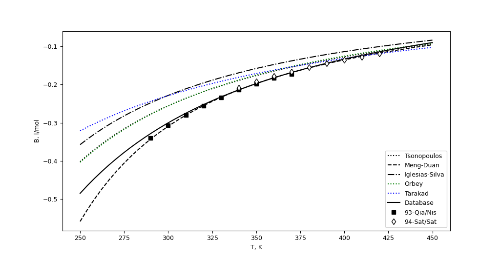

lib.eos.virial module
=====================

Virial equation of state implementation

:func:`lib.EoS.virial.Virial`: The main class with all integrated functionality.

Second virial coefficient correlations:
    * :func:`lib.EoS.virial.B_Tsonopoulos`
    * :func:`lib.EoS.virial.B_IglesiasSilva`
    * :func:`lib.EoS.virial.B_Meng`

Third virial coefficient correlations:
    * :func:`lib.EoS.virial.C_OrbeyVera`
    * :func:`lib.EoS.virial.C_LiuXiang`
    * :func:`lib.EoS.virial.C_Meng`

Example code of usage, plot the correlations for R32 and compare with some
sources of experimental values

.. code-block:: python

    from matplotlib import pyplot
    from scipy import linspace, r_
    from lib.mEoS import R32

    D = R32.momentoDipolar.Debye
    Vc = R32.M/R32.rhoc

    # 2nd virial coefficient
    B1 = []
    B2 = []
    B3 = []
    B4 = []
    Ti = linspace(250, 450, 50)
    for T in Ti:
        B1.append(B_Tsonopoulos(T, R32.Tc, R32.Pc, R32.f_acent)[0])
        B2.append(B_Meng(T, R32.Tc, R32.Pc, R32.f_acent, D)[0])
        B3.append(B_IglesiasSilva(T, R32.Tc, R32.Pc, Vc, R32.f_acent, D)[0])
        B4.append(_B_Database(T, R32.id)[0])
    pyplot.plot(Ti, B1, label="Tsonopoulos", ls=":", c="k")
    pyplot.plot(Ti, B2, label="Meng-Duan", ls="--", c="k")
    pyplot.plot(Ti, B3, label="Iglesias-Silva", ls="-.", c="k")
    pyplot.plot(Ti, B4, label="Database", ls="-", c="k")

    # Experimental date
    # Qian, Z.Y., Nishimura, A., Sato, H., Watanabe, K.
    # Compressibility Factors and Virial Coefficients of Difluoromethane
    # (HFC-32) Determined by Burnett Method
    # JSME Int. J. Ser. B. 36(4) (1993) 665-670
    T = [290, 300, 310, 320, 330, 340, 350, 360, 370]
    B = r_[-0.33975, -0.30666, -0.28011, -0.25594, -0.23379, -0.21422,
           -0.19777, -0.18327, -0.17231]
    pyplot.plot(T, B, ls='', marker="s", mec="k", mfc="k", label="93-Qia/Nis")

    # Sato, T., Sato, H., Watanabe, K.
    # PVT Property Measurements for Difluromethane
    # J. Chem. Eng. Data 39(4) (1994) 851-854
    T = [340, 350, 360, 370, 380, 390, 400, 410, 420]
    B = r_[-207.9, -191.4, -178.2, -166.2, -155.2, -144.7, -135.6, -128.1,
           -119.5]*1e-3
    pyplot.plot(T, B, ls='', marker="d", mec="k", mfc="w", label="94-Sat/Sat")

    pyplot.ylabel("B, l/mol")
    pyplot.xlabel("T, K")
    pyplot.legend()
    pyplot.show()

.. code-block:: python

    from matplotlib import pyplot
    from scipy import linspace, r_
    from lib.mEoS import R32

    Zc = R32.Pc/R32.rhoc/R*R32.M/R32.Tc/1000
    D = R32.momentoDipolar.Debye

    # 3rd Virial coefficient
    C1 = []
    C2 = []
    C3 = []
    Ti = linspace(250, 450, 50)
    for T in Ti:
        C1.append(C_Orbey_Vera(T, R32.Tc, R32.Pc, R32.f_acent)[0]*1e6)
        C2.append(C_Liu_Xiang(T, R32.Tc, R32.Pc, R32.f_acent, Zc)[0]*1e6)
        B = B_Meng(T, R32.Tc, R32.Pc, R32.f_acent, D)
        C3.append(C_Meng(T, R32.Tc, R32.Pc, D, B)[0]*1e6)

    pyplot.plot(Ti, C1, ls=":", c="k", label="Orbey-Vera")
    pyplot.plot(Ti, C2, ls="--", c="k", label="Liu-Xiang")
    pyplot.plot(Ti, C3, ls="-.", c="k", label="Meng-Duan")

    # Sato, T., Sato, H., Watanabe, K.
    # PVT Property Measurements for Difluromethane
    # J. Chem. Eng. Data 39(4) (1994) 851-854
    T = [340, 350, 360, 370, 380, 390, 400, 410, 420]
    C = r_[0.01625, 0.01431, 0.01325, 0.01226, 0.01133, 0.01034, 0.009646, 0.009418, 0.00848]
    pyplot.plot(T, C, ls='', marker="d", mec="k", mfc="w", label="94-Sat/Sat")

    # Defibaugh, D.R., Morrison, G., Weber, L.A.
    # Thermodynamic Properties of Difluoromethane
    # J. Chem. Eng. Data 39(2) (1994) 333-340
    T = [267, 273, 283, 293, 303, 313, 323, 333, 343, 353, 363, 373]
    C = r_[0.0263, 0.027, 0.0274, 0.0268, 0.0256, 0.0242, 0.0226, 0.0209, 0.0193, 0.0178, 0.0162, 0.0149]
    pyplot.plot(T, C, ls='', marker="s", mec="k", mfc="k", label="94-Def/Mor")

    # Zhang, H., Sato, H., Watanabe, K.
    # Gas Phase PVT Properties for the Difluoromethane + Pentafluoroethane
    # (R32+R125) System
    # J. Chem. Eng. Data 41(6) (1996) 1401-1408
    T = [290, 300, 310, 320, 330, 340, 350, 360, 370]
    C = r_[0.0341, 0.0305, 0.0275, 0.0248, 0.0224, 0.0203, 0.0185, 0.0168, 0.0153]
    pyplot.plot(T, C, ls='', marker="v", mec="k", mfc="w", label="96-Zha/Sat")

    pyplot.ylabel("C, cm⁶/mol²")
    pyplot.xlabel("T, K")
    pyplot.legend()
    pyplot.show()

.. image:: images/Cvirial.png
    :alt: Third virial coefficient for R32

.. automodule:: lib.EoS.virial
    :members:
    :undoc-members:
    :show-inheritance:

.. include:: lib.EoS.virial_ref.rst
