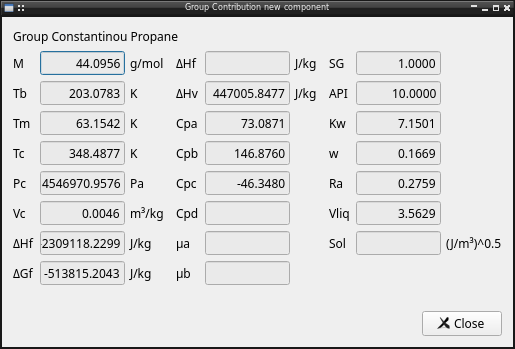

Pychemqt let user define new compounds using any of implemented group contribution

Each method use different group to define compounds, including same of that second/third order group for a better definition of compound. But basically the user interface is similar por all

Only the group list are the mandatory input parameters, we can too define a name, or fix properties like boiling temperature, molecular weight or specific gravity. When the definition is completed it's possible show the calculated properties of new compound

Clicking the save button add the created compound to the user database

API reference
-------------

Base classes with common functionality
    * :class:`newComponente <lib.newComponent._base.newComponente>`: Base class for new component definition
    * :class:`GroupContribution <lib.newComponent._base.GroupContribution>`: Common group contribution functionality

Other methods:
    * :func:`cpLS_Hurst <lib.newComponent._base.cpLS_Hurst>`: Liquid-Solid heat capacities using the Hurst-Harrison method

The group contribution methods available include:
