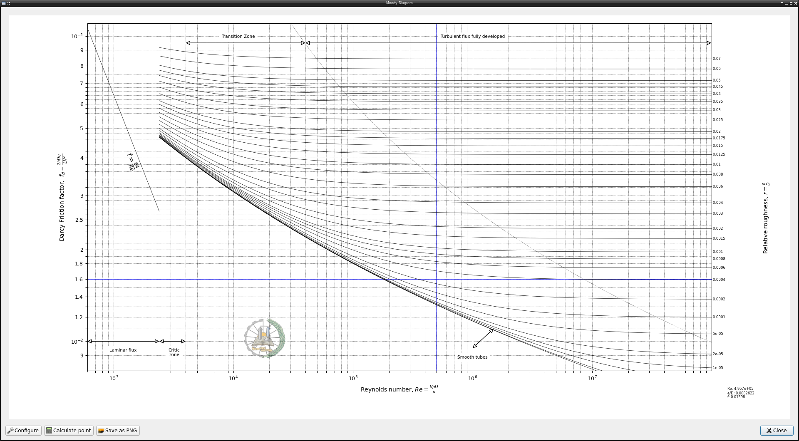
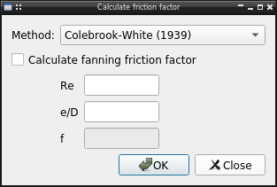
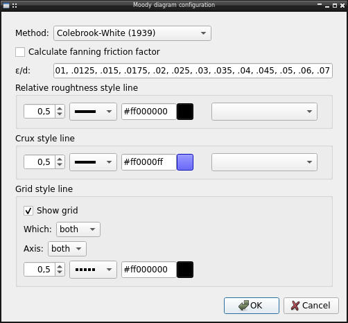

plots.moody package
===================

Plot the moody diagram that relates the friction factor with reynolds number and surface roughness in a circular pipe.

The diagram include all flow regimen, from laminar to fully developed turbulent. Support for click interaction, let user save the chart as image and a dialog to calculate the friction factor:

Configuration
-------------

The diagram let user configure several options like:

* Equation to use, by default the original Colebrook-White, but it's possible
  use one of available in :doc:`lib.friction <../lib.friction>` 
* Change the friction factor used in plot between the darcy (default) and the fanning factor.
* Relative roughtness lines plotted in diagram
* Line style used in plot

