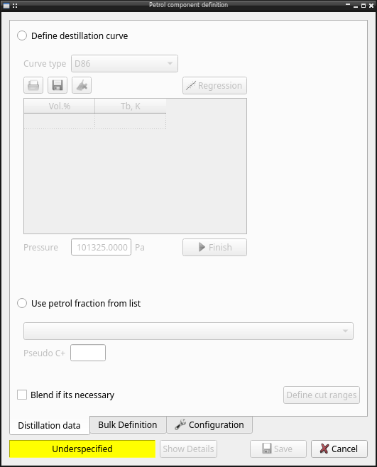

pseudocompound module
=====================

Pychemqt let user define new compounds from a mix of unknown compounds, specially used from petroleum fractions.

The pseudocompound can be defined using several options:

  * Using distillation curve (D86, TBP, SD, D1186, EFV)
  * Using a petroleum fraction from database
  * Define the bulk properties of compound

Clicking the save button add the created compound to the user database and can be used in main program as a normal compound.

Configuration
-------------

Its possible configure the used methods to calculate the properties:

  * Molecular weight
  * Critic properties
  * Critic volume
  * Acentric factor
  * Critic compresibility
  * Boiling temperature
  * Specific gravity (SG)
  * Refractive index
  * PNA (paraffins, naphthenes, aromatics) composition
  * Destilate curve conversion
  * Hydrogen composition

API reference
-------------

The implementation is splitted in several modules:

	* `Pseudocomponent definition <lib.petro.html>`__
	* `Definition from crude database <lib.crude.html>`__
	* `UI module <UI.petro.html>`__
