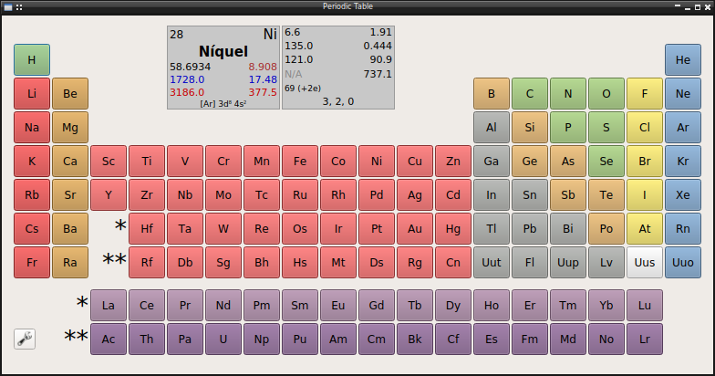
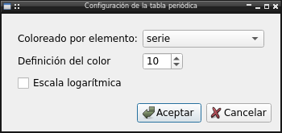

This tool show a Mendeleev periodic table with several properties shown for the
element with the mouse over.

Other properties can be shown clicking in the desired element. The properties
availables are:

    * Atomic number
    * Name
    * Alternate name
    * Symbol
    * Serie
    * Group
    * Period
    * Block
    * Solid density
    * Liquid density
    * Gas density
    * Appearance
    * Date of discovery
    * Country of discovery
    * Discovery author
    * Etymology
    * Atomic mass
    * Atomic volume
    * Atomic radius
    * Covalent radius
    * van der Waals radius
    * Ionic radii
    * Lattice type
    * Space group
    * Lattice edges
    * Lattice angles
    * Electron configuration
    * Oxidation states
    * Electronegativity
    * Electron affinity
    * First ionization
    * Melting temperature
    * Boiling temperature
    * Melting heat
    * Vaporization heat
    * Specific Heat
    * Thermal conductivity
    * Debye temperature
    * Color
    * Notes

Furthermore the element name and several properties has internationalization
support with several languages availables: English, Spanish, German, French,
Portuguese, Italian, Chinese

Configuration
-------------

It's possible change the appareance of element button choosing the property
