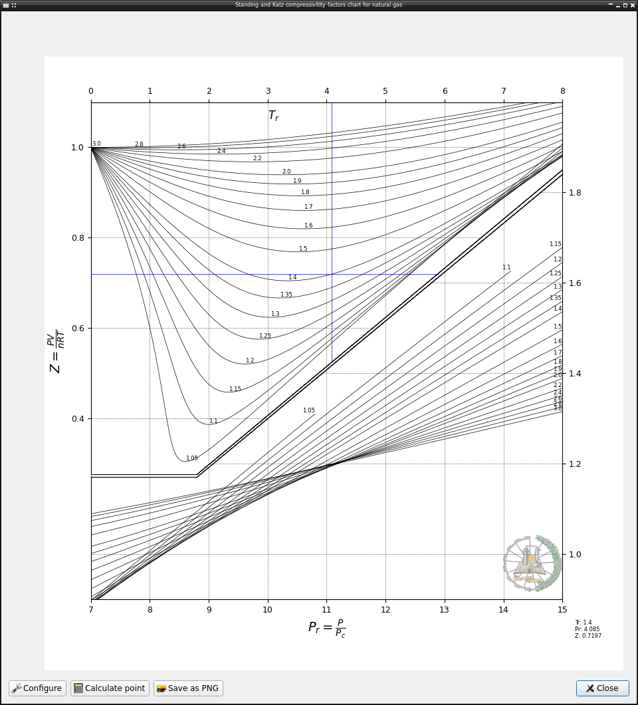
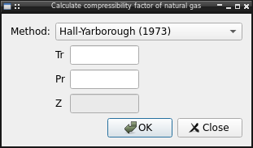
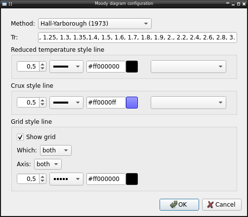

Plot the Standing-Katz diagram that relates compresibility factor with the
reduced temperature and pression of a gas state.

The diagram is configured in extended format for better visibility of all
zones. Support for click interaction, let user save the chart as image and a
dialog to calculate the compresibility factor:

Configuration
-------------

The diagram let user configure several options like:

* Equation to use, by default the Hall-Yarborough correlation, but it's
  possible use one of available in :doc:`lib.crude <../lib.crude>` 
* Reduced temperatures lines plotted in diagram
* Line style used in plot
* Line style used in crux when use mouse 
* Grid line visibility and style
