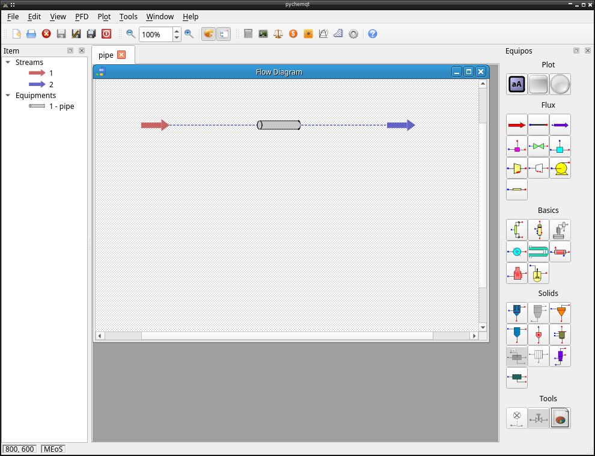
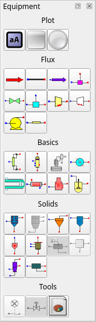
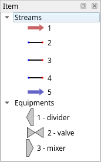
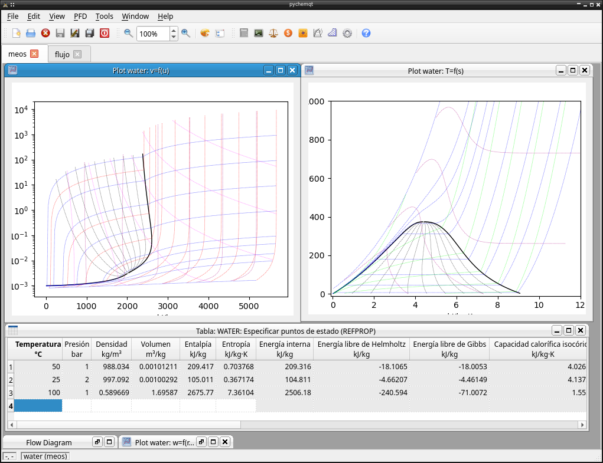
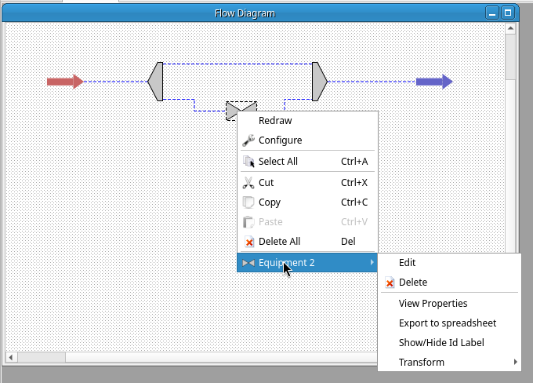

pychemqt user interface
=======================
 
pychemqt inclue a complete user interface 

Menus
-----

Menu File
.........

Normal file operations:

  * Create new project
  * Open existing project
  * Save project to file
  * Save project using a alternate name to avoid overwrite original file
  * Save all open project
  * Close current project
  * Open existing project from a list of recently used project
  * Exit app

Menu Edit
.........

Several edit operations:

  * Wizard: Help user to configure a project, launch when create a new project
    or from this menu entry
  * Component list: Configure chemical compounds used in project
  * Thermodynamic properties: Configure thermodynamic methods used in project
  * Transport properties: Configure methods used for transpor properties
  * Units: Configure prefered units used in project
  * Cost Index: Configure cost index used in cost calculations
  * Preferences: Configure global pychemqt preferences

Menu View
.........

Several view options over PFD and for UI:

  * Zoom out PFD
  * Zoom PFD a specified value
  * Zoom in PFD
  * Show overview window for PFD with a very small zoom
  * Show status panel with log of program
  * Show pallette panel with the equipment available to add to PFD
  * Show item panel with a list of entities in a PFD

Menu PFD
........

Process flow diagram related actions:

  * Redraw PFD
  * Configure PFD
  * Select all components of PFD
  * Cut selected components
  * Copy selected components
  * Paste components clipboard
  * Delete all component in PFD
  * Submenu to add any supported component to PFD
  * Save PFD as image file

Menu Tools
..........

Miscellaneous tools implemented:

  * Chemical compound database
  * Create new chemical compound (defining its properties, using a group contribution method or using method from petrol fractions)
  * Open external calculator
  * Open python shell with pychemqt library imported
  * Units converter
  * Currency converter
  * Chemical element periodic table
  * MEoS advanced properties library
  * Psichrometric chart
  * Miscellaneus tiny chart tools including Moody, Standing-Katz, Drag sphere...

Menu Window
...........

Mdi area related actions:

  * Move to previous window
  * Move to next window
  * Fill space available with windows in tile mode
  * Show windows in cascade mode
  * Restore all windows to defined size
  * Iconize all windows
  * Close active window

Menu Help
.........

Help menu with several entries:

  * Help: Open pychemqt documentation, firstly it search in local file system or open the readthedocs page
  * View log: Open pychemqt log file
  * References: Open window with references used in program
  * External programs: Open window with list of external optional libraries and its installation status
  * About pychemqt: Open window with basic information about pychemqt
  * About Qt: Open window with qt information

Toolbar
-------

There are a toolbar for fast access to basic functions

Equipment Panel
---------------

From view menu it's possible enable the visibility of a toolbox to easy access to equipment when we are going to add it to PFD

Item Panel
----------

A summary of elements in PFD are shown in this pallete. With right click we have access to specific actions as in PFD

MDI Area
--------

The central area for main program support a tab system with capacity to load several project simultaneously. In each tab with a open project we have a complete windows system with support for include different kind of window including the PDF, and other windows like mEoS related functionality, plots, tables or any more.

This area let common windows actions like iconify, maximize, minimize, restore, show windows in cascade or tile format... That options can be get clicking in subwindow titlebar and from window menu.

PFD
...

In the Process Flow Diagram windows we can manipulate the process, add stream, add equipment, edit or view its properties, or edit its appearance, etc...

